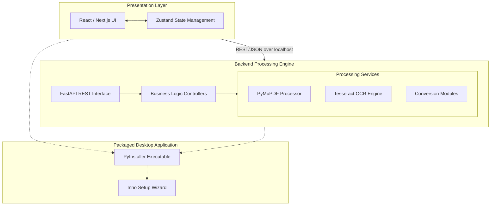

<div align="center">
  
  <br><br>

  # OpenPDF

  [](https://opensource.org/licenses/MIT)
  [](https://github.com/albert-dilas/OpenPDF/actions/workflows/ci.yml)
  []()
  [](https://albert-dilas.github.io/OpenPDF)
  [](https://www.python.org/downloads/release/python-3120/)
  [](https://nextjs.org/)

  **An open-source, fully localized platform for processing and manipulating PDF documents.**

</div>

## 📑 Table of Contents
- [Download & Install (For Users)](#-download--install-for-users)
- [Overview](#-overview)
- [Screenshots](#-screenshots)
- [Core Capabilities](#-core-capabilities)
- [System Architecture](#-system-architecture)
- [Development and Build Instructions](#-development-and-build-instructions)
- [Contributing](#-contributing)
- [License](#-license)

## 📥 Download & Install (For Users)

If you are not a developer and just want to use **OpenPDF**, you don't need to build it from source!

1. Go to the [**Releases page**](../../releases) on the right side of this GitHub repository.
2. Download the latest version: `OpenPDF_Setup_v1.x.x.exe`.
3. Double-click the downloaded file to run the installer and follow the instructions.

## 🔍 Overview

Designed with strict data privacy in mind, the system executes all processing tasks locally on the host machine, eliminating the need for external network transmissions or third-party cloud services. 

The application is structured as a monolithic desktop executable with a decoupled architecture. It bundles a high-performance Python processing engine (Backend) with a modern React-based user interface (Frontend).

## 📸 Screenshots

<div align="center">
  
  <br>
  <em>Figure 1: Main Dashboard UI</em>
</div>
<br>
<div align="center">
  
  <br>
  <em>Figure 2: Complete Tool Suite</em>
</div>
<br>
<div align="center">
  
  <br>
  <em>Figure 3: Active Document Processing Workflow</em>
</div>

## 🚀 Core Capabilities

- **Local Processing**: Absolute data privacy with zero external API dependencies for document processing.
- **Document Manipulation**:
  - File compression, merging, and splitting operations.
  - Bidirectional document conversions (PDF to JPG/PNG, PDF to DOCX, PDF to Markdown).
  - Cryptographic operations including document encryption and decryption.
  - Optical Character Recognition (OCR) capabilities.
  - Structural modifications such as page rotation, watermarking, and pagination.
- **Standalone Distribution**: Deployed as a single executable binary, requiring no pre-installed dependencies from the end user.

## 🏗️ System Architecture

The project adheres to Clean Architecture principles, ensuring a robust, scalable, and highly maintainable codebase.



- **/backend**: Python-based RESTful API utilizing the FastAPI framework. It manages the core processing logic through libraries such as PyMuPDF (fitz) and PyTesseract.
- **/frontend**: Presentation layer built with Next.js (App Router), React, and Tailwind CSS. It is statically exported for embedded execution.
- **/installer**: Asset directory and Inno Setup configuration files for Windows installer generation.
- **/scripts**: Automated Python pipelines for building, packaging, and deploying the application.

## 🛠️ Development and Build Instructions

### Prerequisites
- **Node.js**: Required for compiling the static frontend assets.
- **Python 3.x**: Required for the backend server and packaging scripts.
- **Inno Setup**: Required for generating the Windows installation wizard.

### Build Pipeline
The project includes automated build scripts to compile the application from source. Execute the following commands from the project root:

```bash
# Compile the static frontend and package the standalone executable
python scripts/build_exe.py

# Generate the distributable Windows installer
python scripts/build_installer.py
```
Compiled artifacts will be output to the `dist/` directory.

## 🤝 Contributing

We welcome contributions from the community! Please read our [CONTRIBUTING.md](CONTRIBUTING.md) to learn about our development process, how to propose bug fixes and improvements, and how to build and test your changes.

## 📄 License

This project is distributed under the [MIT License](LICENSE). Please refer to that document for full terms of use and distribution.
