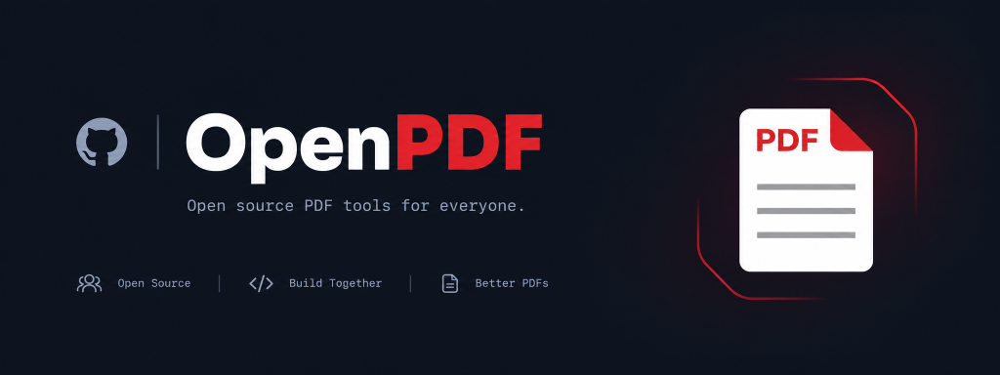
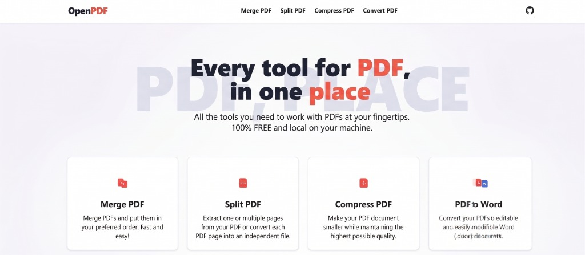
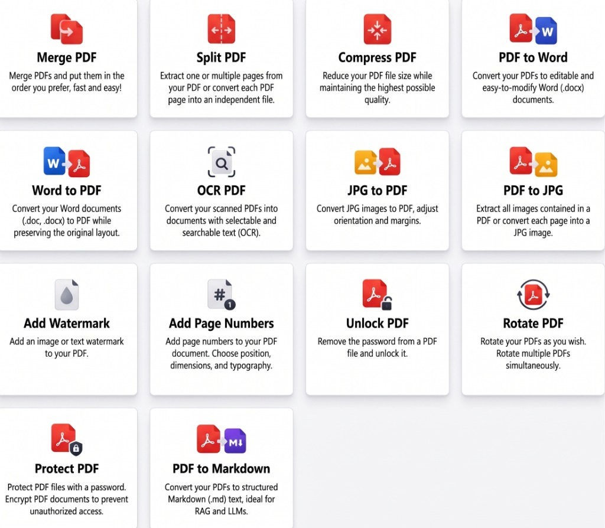
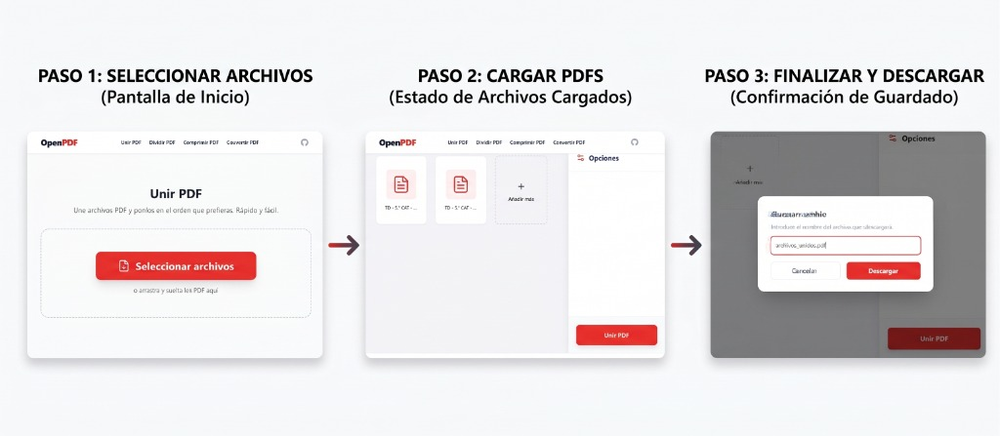

<div align="center">
  
  <br><br>

  # OpenPDF

  [](https://opensource.org/licenses/MIT)
  []()
  []()
  [](https://www.python.org/downloads/release/python-3120/)
  [](https://nextjs.org/)

  **An open-source, fully localized platform for processing and manipulating PDF documents.**

</div>

## Table of Contents
- [Overview](#overview)
- [Screenshots](#screenshots)
- [Core Capabilities](#core-capabilities)
- [System Architecture](#system-architecture)
- [Development and Build Instructions](#development-and-build-instructions)
- [License](#license)

## Overview

Designed with strict data privacy in mind, the system executes all processing tasks locally on the host machine, eliminating the need for external network transmissions or third-party cloud services. 

The application is structured as a monolithic desktop executable with a decoupled architecture. It bundles a high-performance Python processing engine (Backend) with a modern React-based user interface (Frontend).

## Screenshots

<div align="center">
  
  <br>
  <em>Figure 1: Main Dashboard UI</em>
</div>
<br>
<div align="center">
  
  <br>
  <em>Figure 2: Complete Tool Suite</em>
</div>
<br>
<div align="center">
  
  <br>
  <em>Figure 3: Active Document Processing Workflow</em>
</div>

## Core Capabilities

- **Local Processing**: Absolute data privacy with zero external API dependencies for document processing.
- **Document Manipulation**:
  - File compression, merging, and splitting operations.
  - Bidirectional document conversions (PDF to JPG/PNG, PDF to DOCX, PDF to Markdown).
  - Cryptographic operations including document encryption and decryption.
  - Optical Character Recognition (OCR) capabilities.
  - Structural modifications such as page rotation, watermarking, and pagination.
- **Standalone Distribution**: Deployed as a single executable binary, requiring no pre-installed dependencies from the end user.

## System Architecture

The project adheres to Clean Architecture principles, organized into the following primary components:

- `/backend`: Python-based RESTful API utilizing the FastAPI framework. It manages the core processing logic through libraries such as PyMuPDF (fitz) and PyTesseract.
- `/frontend`: Presentation layer built with Next.js (App Router), React, and Tailwind CSS. It is statically exported for embedded execution.
- `/installer`: Asset directory and Inno Setup configuration files for Windows installer generation.
- `/scripts`: Automated Python pipelines for building, packaging, and deploying the application.

## Development and Build Instructions

### Prerequisites
- **Node.js**: Required for compiling the static frontend assets.
- **Python 3.x**: Required for the backend server and packaging scripts.
- **Inno Setup**: Required for generating the Windows installation wizard.

### Build Pipeline
The project includes automated build scripts to compile the application from source. Execute the following commands from the project root:

```bash
# Compile the static frontend and package the standalone executable
python scripts/build_exe.py

# Generate the distributable Windows installer
python scripts/build_installer.py
```
Compiled artifacts will be output to the `dist/` directory.

## License

This project is distributed under the standard license terms provided in the `LICENSE` file. Please refer to that document for full terms of use and distribution.
